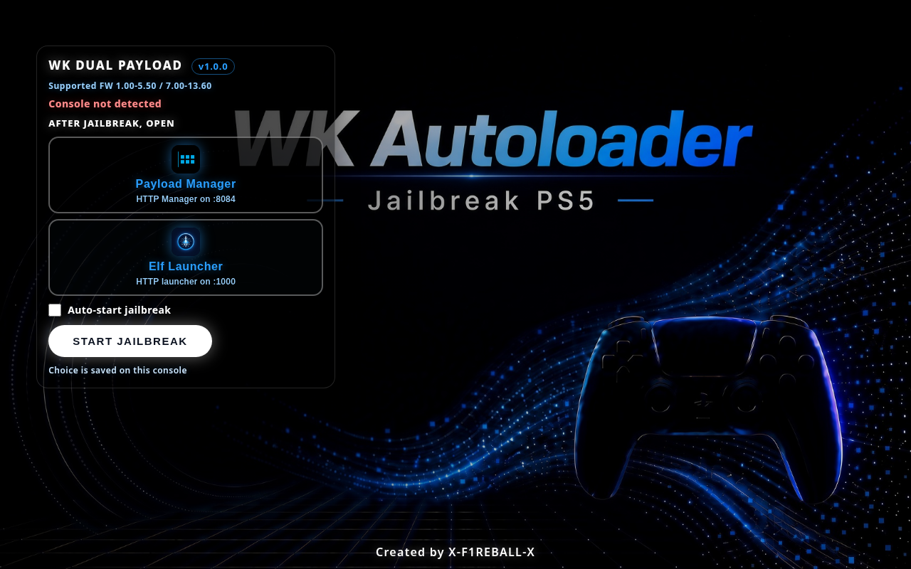

# WK Autoloader 
Dual Payload

## Preview

PS5 homebrew: jailbreak UI on port **1022**. Chains: **umtx2** (1-5.50), **relapse** (7.00-13.60).

- Pages: https://x-f1reball-x.github.io/wk-dual-payload/
- Download ELF: https://github.com/X-F1REBALL-X/wk-dual-payload/releases/latest

## What the ELF does

`wk-dual-payload.elf` installs a **Media** home-screen app and caches the offline UI. After that finishes, the home icon works offline, including after reboot, until the cache is invalidated. No need to resend the ELF each boot.

After the jailbreak, the page installs [Elf Launcher](https://github.com/X-F1REBALL-X/elf-launcher) and Payload Manager only when each one is missing, then opens the one you picked.

## Use

1. Soft jailbreak the console and start **elfldr** on port **9021**.
2. Send `wk-dual-payload.elf` to `9021` and wait until caching and install finish.
3. Open `http://PS5_IP:1022`, or the [Pages host](https://x-f1reball-x.github.io/wk-dual-payload/). The home icon works offline after install.
4. On the splash, pick Payload Manager or Elf Launcher, then press **Start Jailbreak**. The choice is saved on the console.

## Payload loaders

- **Payload Manager on `:8084`** loads and sends payloads from its HTTP manager.
- **Elf Launcher on `:1000`** loads ELF payloads via BinLoader. See the [Elf Launcher repository](https://github.com/X-F1REBALL-X/elf-launcher).

## Ports

| Port | Role |
|------|------|
| **1022** | WK Dual Payload |
| **9021** | elfldr, send `wk-dual-payload.elf` and other ELFs |
| **8084** | Payload Manager |
| **1000** | [Elf Launcher](https://github.com/X-F1REBALL-X/elf-launcher) |

## Firmware

| FW | Chain |
|----|-------|
| 1.xx-5.50 | umtx2 |
| 6.xx | unsupported |
| 7.00-13.60 | relapse |

## Credits

**X-F1REBALL-X** — packaging, routing, UI.

### umtx2 (1.xx-5.50)

[idlesauce/umtx2](https://github.com/idlesauce/umtx2): exploit largely from @shahrilnet / @n0llptr (lua UMTX); setup from @SpecterDev / @ChendoChap ([PS5-UMTX-Jailbreak](https://github.com/PS5Dev/PS5-UMTX-Jailbreak/)); PSFree by abc; ELF loader by @john-tornblom.

### Relapse (7.00-13.60)

ntfargo, ufm42, Sonic_Iso, Jordy, Dr. Yenyen, TheFlow, SlidyBat, Flatz, cow, nhk, bollarz, Sleirsgoevy, EchoStretch, EarthOnion
